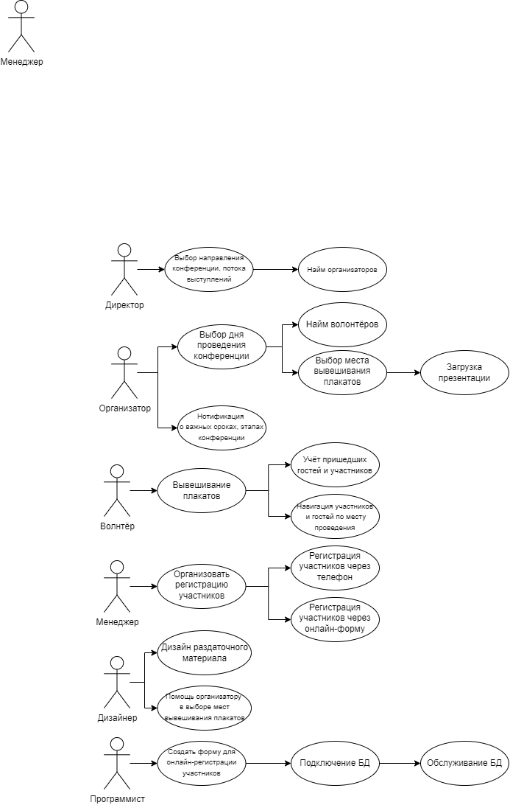
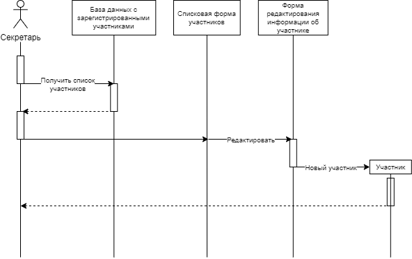
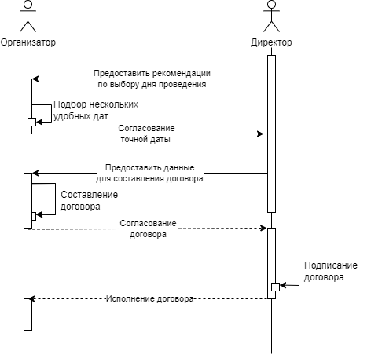

# Лабораторная работа №6
В Герценовском университете проводится конференция. Планируется постерная сессия (в зале выставляются плакаты и меж них ходят авторы постеров, с которыми можно пообщаться), сессия докладов (2 потока) и публикация сборника.
Требуется создать информационную систему, которая бы позволяла автоматизировать решение задач, которые должны выполнить организаторы этой конференции. 
## Основные функции:
1. регистрация участников конференции;
2. нотификация об важных сроках, этапах конференции;
3. выбор места вывешивания постера;
4. выбор дня и потока выступления;
5. загрузка презентации.
## Требования к заданию:
* создайте диаграмму прецедентов;
* создайте диаграмму (или диаграммы) последовательности (минимум, для 2 функций системы).

В отчёте отразите ответы на следующие вопросы:
* каких бы вы привлекли специалистов для решения этой задачи?
* как организовали бы работу в команде (роли, сроки)?
* предположим вы решили использовать методологию SCRUM. Сформулируйте список задач на первые несколько спринтов.

### Диаграмма прецедентов:

### Диаграмма последовательности для регистрации новых участников:

### Диаграмма последовательности для выбора дня проведения конференции

1. Каких бы вы привлекли специалистов для решения этой задачи? 
    Директор, организатор, менеджер, программисты, дизайнер и волонтёры.
    
2. Как организовали бы работу в команде? 
    * Директор - согласование договора, найм на работу (первая-вторая недели).
    * Организатор - согласование даты проведения конференции, нахождение удобного места проведения конференции (первая-вторая недели), найм волонтёров, выбор места вывешивания плакатов (третья-четвёртая недели), организация работы волонтёров, загрузка презентации (день конференции). 
    * Программисты - создание онлайн-формы для регистрации, подключение БД, обслуживание БД (на протяжении всей подготовки конференции). 
    * Дизайнер - создание раздаточного материала, консультация организатора по вопросам расположения плакатов (третья-четвёртая неделя). 
    * Менеджер - ответ на телефонные звонки, консультирование участников о подробностях проведеня конференции, регистрация участников через онлайн-форму или по телефону (на протяжении всего времени подготовки). 
    * Волонтёры - развешивание плакатов, учёт пришедших гостей и участников, навигация гостей и участников по конференции (в день проведения конференции).
   
3. Предположим вы решили использовать методологию SCRUM. Сформулируйте список задач на первые несколько спринтов.
- Согласование даты, времени и места проведения конференции
- Создание БД с участниками конференции
- Подбор волонтёров
